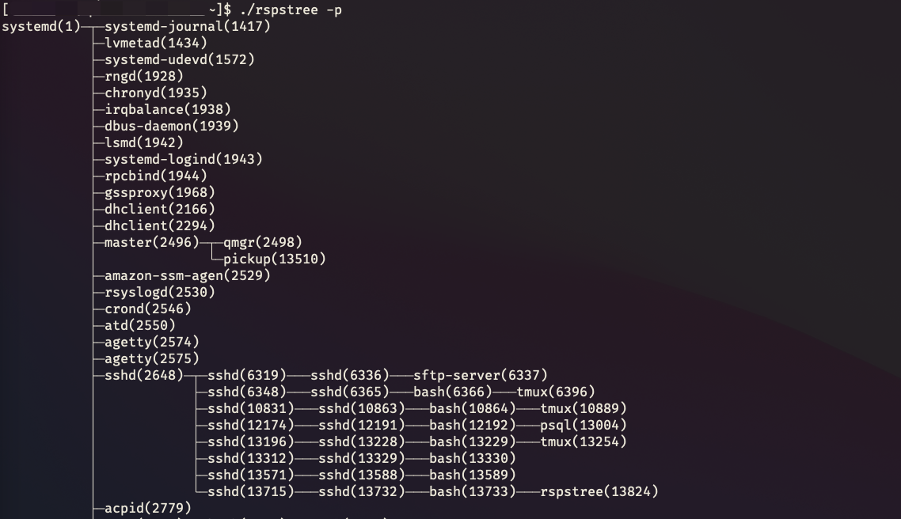

# rspstree

<br/>
<p align="center">


</p>

implement [pstree](https://man7.org/linux/man-pages/man5/proc.5.htm) using rust.

using [clap](https://github.com/clap-rs/clap) for POSIX Compatible

## install

```bash
git clone git@github.com:rrylee/rust-pstree.git

cd rust-pstree && cargo build
```

```shell
rspstree --help

USAGE:
    rspstree [FLAGS] [PID]

ARGS:
    <PID>
            start at this PID; default is 1 (init)

FLAGS:
    -h, --help
            Prints help information

    -p, --show-pgids
            Show PIDs.  PIDs are shown as decimal numbers in parentheses after each process name.
            -p implicitly disables compaction.

    -v, --verbose
            Enable verbose mode.

    -V, --version
            Prints version information
```

## TODO

- [ ] pthread
- [ ] merge simple process
